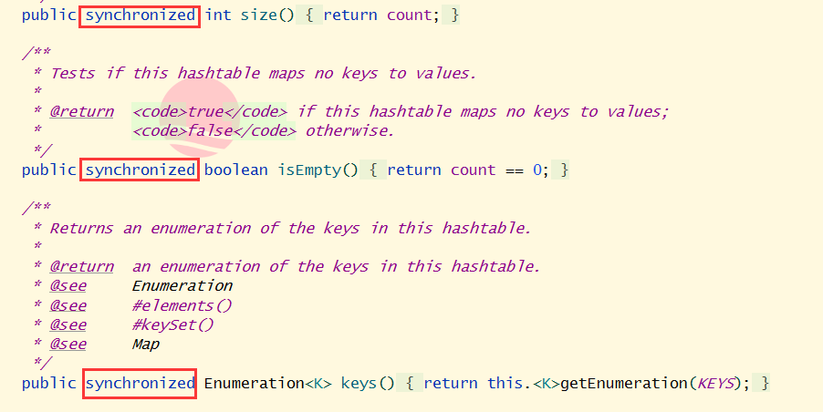

## HashMap 与 Hashtable 的区别

**同步性**：HashMap的方法没有synchronized，所以是线程不安全，而Hashtable的每个方法都有`synchronized`关键字，所以是线程安全。

**性能区别**：由于Hashtable 的方法由`synchronized`关键字修饰所以线程进入方法的时候需要等待，所以性能大打折扣，而HashMap则要快的多。

`HashMap`

`Hashtable`

**继承的父类不同**：HashMap继承的父类是AbstractMap(抽象map)；

Hashtable继承的父类是Dictionary(字典)。

**<K,V>能否为空**：首先说明，Hashtable不允许key和value为空，而HashMap的key和value可以为空。   继续往下看，代码中的`int hash = key.hashCode()`key如果为null，就不会为空了。

而HashMap中没有强调Key为null；`hash ^ hash >>> 16`为了保存高位低位信息，更加均匀分配，减少碰撞。

**初始容量**：HashMap初始容量是`16`，扩容的时候是×2；Hashtable初始容量`11`，扩容的时候×2+1，并且在调用构造方法的时候就开始初始化了。

Hashtable：

HashMap：

