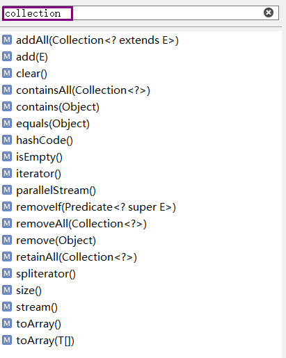
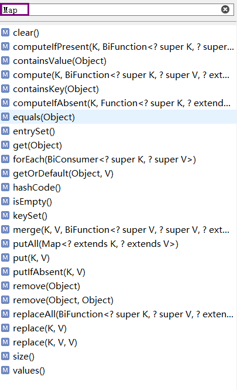

## 集合

#### Java容器类库图


此图出自《Java编程思想》，虚线框则是抽象类。此图清晰的展示了Java容器内的各个关系。

#### 初识容器

 **Map**：一组成对的“键值对”对象，即 “key-value”对象，允许使用键来查找值操作。我们可以将数值与数值关联，这时可以将map理解为一个数值数组；同样可以将数值与对象关联，这时将其称之为映射表，或者是关联数组；又或者可以理解为字典结合等等。

**Collection**：可以理解为一个标准，例如上图所示：List、Set和Queue(新版增加了Queue)。  
*Java程序最终使用的数据结构都是继承自这两个接口*。

**Collection** 接口的接口 对象的集合（单列集合）  
├——-**List** 接口：元素按插入先后有序保存，可重复  
│—————-├ **LinkedList** 接口实现类， 链表， 插入删除， 没有同步， 线程不安全  
│—————-├ **ArrayList** 接口实现类， 数组， 随机访问， 没有同步， 线程不安全  
│—————-└ **Vector** 接口实现类 数组， 同步， 线程安全  
│ ———————-└ **Stack** 是Vector类的实现类  
└——-**Set** 接口： 仅接收一次，不可重复，并做内部排序  
├—————-└**HashSet** 使用hash表（数组）存储元素  
│————————└ **LinkedHashSet** 链表维护元素的插入次序  
└ —————-**TreeSet** 底层实现为二叉树，元素排好序    

**Map** 接口： 键值对的集合，键不可重复，值可以重复 （双列集合）   
├———**Hashtable** 接口实现类， 同步， 线程安全  
├———**HashMap** 接口实现类 ，没有同步， 线程不安全-  
│—————–├ **LinkedHashMap** 双向链表和哈希表实现  
│—————–└ **WeakHashMap**  针对特定的情况，*弱键*，没有被其他引用所指，则可能会被当作垃圾回收  
├ ——–**TreeMap** 红黑树对所有的key进行排序  
└———**IdentifyHashMap**  针对特定的情况  ==代替equals()方法

###### Conllection



实现了collection接口的，增加元素`add()`，删除元素`remove()`，查询元素`iterator()`(下面会讲到**Iterator**)等方法。

###### Map



实现了Map接口的，增加元素则是`put(key,value)`，查询元素`get(key)`

Map的由上述所以知，Map的实现有哪些，所以写一个简单的实现：

```java
public class Demo<K,V>{
    private Object[][] p;
    private int index;
    public Demo(int len){
        p = new Object[len][2];
    }
    
    public void put (K key,V value){
        if(index >= p.length){
            throw ArrayOutOfBoundsException();
        }
        p [index++] = new Object[]{key,value};
    }
    public V get(K key){
        for(int i=0;i<index;i++){
            if (key.equals(p[i][1])){
                return (V)p[i][1];
            }
        }
        return null;
    }
    public static void main(String[]args){
        Demo<String,String> map = new Demo(2);
        map.put("aa","AA");
        map.put("bb","BB");
        System.out.print(get("bb"));
    }
}
-----------------------------------------------------------------------------------
输出：
    BB
```

#### 性能

映射表最大的问题就是性能，get()执行方法为线性搜索，固然很慢，而**HashMap**就在此提高了速度。HashMap使用了特殊的值`散列码`。它是取代缓慢的搜索，散列码是一个int类型的一串数字，散列码的根是**Object**的方法，所以所有的类都继承拥有这个方法。**HashMap**就是根据`HashCode()`方法进行快速查询，提高性能。  
在此，提一下`ConcurrentHashMap`，一种线程安全的Map，他不涉及同步加锁，是并发的内容。

#### 桶

桶的概念就是，数组和链表的组合。可以理解为，先在数组查找元素所在的行位置，再从链表查找元素的所在的列。

#### 散列码

散列码就是标识数字，HashMap就是靠着`HashCode`，在容器内部快速搜索的。如果有相同的`HashCode`，则调用`equals`比较，确确实实的同一个，则覆盖上一个value，若不同，按hashcode放好位置。`hashCode()并不总需要返回唯一的标识，但是equals()必须严格判断两个对象是否相等。`

#### equals

equals在此判断当前键是否与表中存在的键是否相同。正确的equals()方法有5个条件：

1. 自反性。`x.equals(x)`一定是**true**。

2. 对称性。`y.equals(x)`等价于`x.equals(y)`。

3. 传递性。`x.equals(y)`返回**true**，`z.equals(y)`返回**true**，则`x.equals(z)`也是**true**

4. 一致性。要么一直是true，要么一直是false。

5. 任何不是null的x，`x.equals(null)`一定是false。  

   所以通常情况下，覆盖`hashCode()`方法时，同时也覆盖`equals()`方法。

   点击查看：[为何重写equals方法就得重写hashCode方法](https://zhuanlan.zhihu.com/p/50206657)。

#### 什么是哈希冲突？

由于哈希算法被计算的数据是无限的，而计算后的结果范围有限，因此总会存在不同的数据经过计算后得到的值相同，这就是哈希冲突。

#### 解决哈希冲突的几种方法

大致有四种方法：[详情](https://www.cnblogs.com/tag6254/p/9416946.html)
       1. 开放定址法（ 平方探查法、线行探查法、双散列函数探查法）
       2. 链地址法（拉链法）
       3. 再哈希法
       4. 建立公共溢出区

#### Iterator 

迭代器，用于访问。主要方法有 `hasNext()`和 `next()` 用法如下：

```java
    public static void main(String[]args){
        Map<String,String> map = new HashMap();
        map.put("aa","AA");
        map.put("bb","BB");
        Iterator iter = map.iterator();
 		while(iter.hasNext()){
     		String str = (String) iter.next();
            //List<String> list = iter.next();
     		System.out.println(str);
        }
    }
```


#### HashMap

**容量：**表中的桶数。

**初始容量：**表在创建时所拥有的桶位。

**负载因子：**表所承受的容量和查找的代价。

#### HashMap 与 HashTable

HashMap是Hashtable的轻量级实现（非线程安全的实现），他们都完成了Map接口。  
主要的区别有：线程安全性，同步(synchronization)，以及速度。  
1.Hashtable继承自Dictionary类，而HashMap是Java1.2引进的Map interface的一个实现。  
2.HashMap允许将null作为一个entry的key或者value，而Hashtable不允许。  
3.HashMap是非synchronized，而Hashtable是synchronized，这意味着Hashtable是线程安全的，多个线程可以共享一个Hashtable；而如果没有正确的同步的话，多个线程是不能共享HashMap的。Java 5提供了ConcurrentHashMap，它是HashTable的替代，比HashTable的扩展性更好。（在多个线程访问Hashtable时，不需要自己为它的方法实现同步，而HashMap 就必须为之提供外同步(Collections.synchronizedMap)）  
4.另一个区别是HashMap的迭代器(Iterator)是fail-fast迭代器，而Hashtable的enumerator迭代器不是fail-fast的。所以当有其它线程改变了HashMap的结构（增加或者移除元素），将会抛出ConcurrentModificationException，但迭代器本身的remove()方法移除元素则不会抛出ConcurrentModificationException异常。但这并不是一个一定发生的行为，要看JVM。这条同样也是Enumeration和Iterator的区别。fail-fast机制如果不理解原理，可以查看这篇[文章](http://www.cnblogs.com/alexlo/archive/2013/03/14/2959233.html)  
5.由于HashMap非线程安全，在只有一个线程访问的情况下，效率要高于HashTable。  
6.HashMap把Hashtable的contains方法去掉了，改成containsvalue和containsKey。因为contains方法容易让人引起误解。   
7.Hashtable中hash数组默认大小是11，增加的方式是 old*2+1。HashMap中hash数组的默认大小是16，而且一定是2的指数。

#### collection同步控制

```java
public class Synchronization{
    public static void main(String[]args){
        Conllection <String> c = Collections.synchronizedCollection(new ArrayList<String>());
        List<String> l = Collections.snchronizedCollection(new ArrayList<String>());
        Set<String> s = Collections.snchronizedSet(new Treeset>());
        Map<String,String> m = Collections.snchronizedMap(new HashMap<String,String>());
    }
}
```

***HashMap难点主要是底层实现。***

