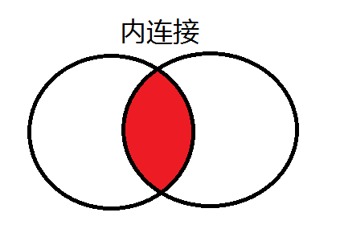
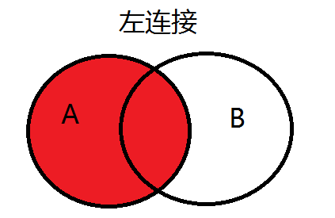
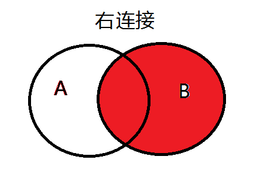
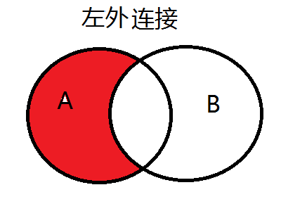
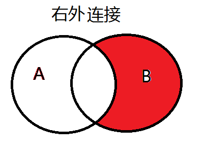
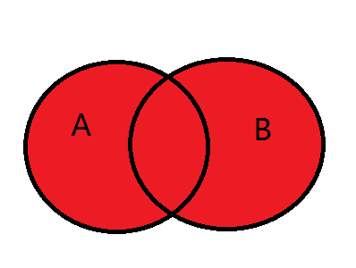
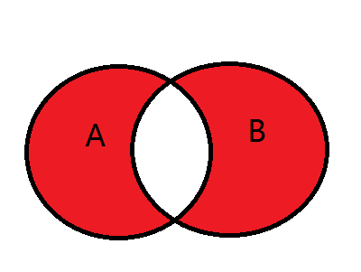

## Join

#### 内连接

`select * from table_a a inner join table_b b on a.id = b.id;`  
**查询只包含A表和B表公共部分数据**。  

#### 左连接

`select * from table_a a left join table_b b on a.id = b.id;`    
**查询A表和B表公共部分数据 *和* A表独有数据**（即查询整个A表）。  

#### 右连接

`select * from table_a a right join table_b b on a.id = b.id;`    
 **查询A表和B表公共部分数据 *和* B表独有数据**（即查询整个B表）。   

#### 左外连接

`select * from table_a a left join table_b b on a.id = b.id where b.id is null;`     
**只查询A独有的数据。**  

#### 右外连接

`select * from table_a a right join table_b b on a.id = b.id where a.id is null;`       
**只查询B独有的数据。**  

#### 全连接

`select * from table_a a left join table_b b on a.id = b.id`  
`union`    
`select * from table_a a left join table_b b on a.id = b.id;`  
**查询A表数据和B表数据。**  

#### 全外连接

`select * from table_a a left join table_b b on a.id = b.id where b is null`  
`union`    
`select * from table_a a left join table_b b on a.id = b.id where a is null;`   
**查询A表和B表的独有部分数据。**  
