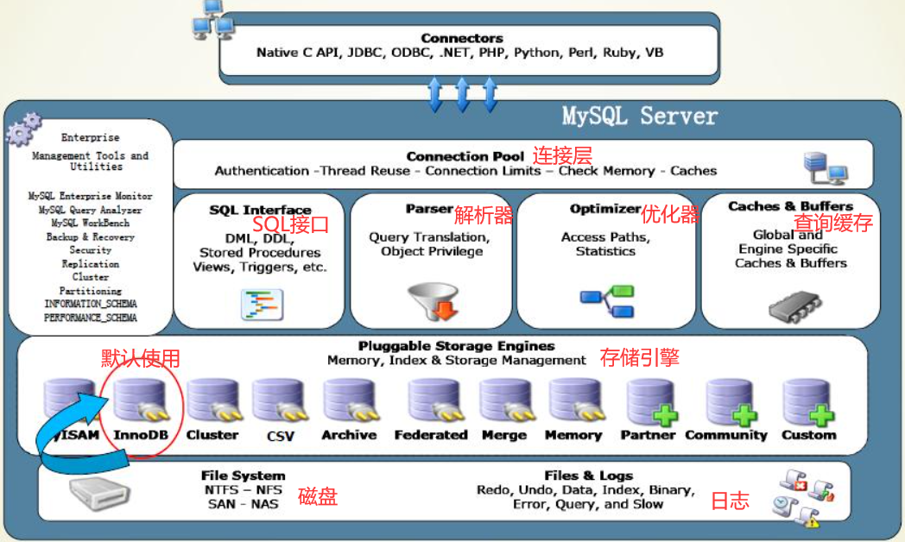
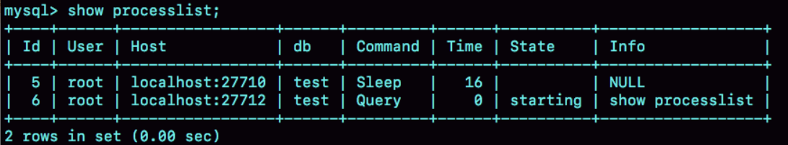

# 查询语句的执行过程

当我们输入下面的执行命令，返回查询结果，MySQL的内部执行过程是怎样的？

```mysql
mysql>select * from table where id = 1;
```

这不得不说一下MySQL的内部结构。

## MySQL逻辑架构

下图为MySQL的逻辑架构图：



大致分为两块：

1. Server层
2. 存储引擎

##### 连接器

首先，需要连接上我们的数据库，`连接器负责和客户端建立连接、获取权限、维持和管理连接`（指连接数据库的操作，例 JDBC）。

```mysql
mysql -hlocalhost -P3306 -uroot -p
```

输入完命令，用户名和密码正确后，通过TCP三次握手建立完成连接，连接器开始**认证身份**。**注意**，这个身份认证操作，此时读取到你的当前权限，若再经过修改，也是在新建连接才会生效，并不会影响当前权限。

连接完成后，若没有后续操作，连接处于空闲状态。通过 `show processlist`可以查看**Command**。



如果太长时间没动静，连接器就会自动将它断开。这个时间是由参数 `wait_timeout `控制的，默认值是 8 小时。

连接断开之后，客户端再次发送请求的话，就会收到一个错误提醒： Lost connection to MySQL server during query。这时候如果你要继续，就需要重连，然后再执行请求了。

##### 查询缓存

建立连接后，就可以执行SQL语句了。接受到请求后，首先，要去查询缓存中去查找是否执行过这条语句。之前执行过的语句会以`Key-Value`的形式缓存在内存中，Key 是语句，Value 是结果。

- 如果可以找到 key 则将 value 返回给客户端。
- 如果没有找到 key 则继续后面的执行阶段。待执行完成后，将结果存入缓存中。

这样MySQL可以省去很多步骤，可以大大提升效率。

`不过，大多数情况下，建议不要使用查询缓存，因为弊大于利。`

只要表更新，查询缓存就会清空。对于更新压力大的数据库来说，查询缓存的命中率会非常低。除非你的表很长时间才会更新一次。

可以将参数 query_cache_type 设置成 DEMAND，这样对于默认的 SQL 语句不使用查询缓存。

**注意**，MySQL 8.0 版本直接将查询缓存的整块功能删掉了。

##### 解析器

当接受到一条语句后，解析器要将你所输入的命令进行"翻译"。

先进行词法分析，识别命令中的每个关键字。将 select 识别，要做查询；把字符串"table" 识别成 表table，"id" 识别成 字段 id。

再进行语法分析。根据词法分析的结果，语法分析器会根据语法规则，判断输入的这个 SQL 语句是否为 MySQL 语法。

##### 优化器

解析器将解析结果交给优化器来处理。优化器是在表里面有多个索引的时候，决定使用哪个索引；或者怎么执行可以使得效率最高。

优化器阶段完成后，这个语句的执行方案就确定下来了，然后进入执行器阶段。

##### 执行器

执行器开始执行语句。开始执行的时候，要先判断一下你对这个表 table 有没有执行查询的权限，如果没有，就会返回没有权限的错误，如下所示 (在工程实现上，如果命中查询缓存，会在查询缓存返回结果的时候，做权限验证。查询也会在优化器之前调用 precheck 验证权限)。

```mysql
mysql> select * from T where ID=10;

ERROR 1142 (42000): SELECT command denied to user 'b'@'localhost' for table 'T'
```

如果有权限，就打开表继续执行。打开表的时候，执行器就会根据表的引擎定义，去使用这个引擎提供的接口。

执行器的执行流程：

1. 调用 InnoDB 引擎接口取这个表的第一行，判断 id 值是不是 1，如果不是则跳过，如果是则将这行存在结果集中；
2. 调用引擎接口取“下一行”，重复相同的判断逻辑，直到取到这个表的最后一行；
3. 执行器将上述遍历过程中所有满足条件的行组成的记录集作为结果集返回给客户端。

至此，一条 SQL 语句执行完成。


### 小结

我们通过一条查询语句，来了解了 MySQL 的逻辑架构。首先要进行**连接**，在连接过后，去**查询缓存**进行查询，若曾经查询过此语句，直接返回结果。若没有，则交给**解析器**进行词法分析和语法分析，分析结果都正确无误后，交给**优化器**进行执行计划选择，选取最优方案交给**执行器**进行语句执行。

