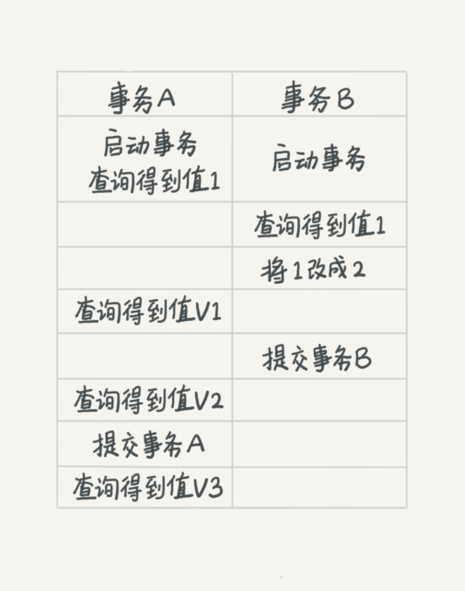
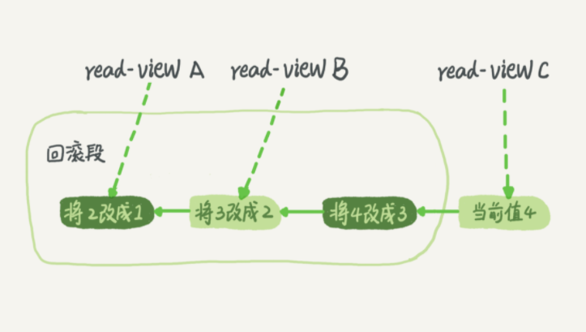

# 事物的隔离性

说到事物，老生常谈的就是银行转账了，A 有 1000￥，给 B 转500￥，转账的过程会涉及查询余额、计算余额结果、更新余额一系列的操作，这些操作必须保证是一起完成的，不然等程序查完之后，还没做计算之前，这 1000￥完全可以再转几次。

## 隔离性与隔离级别

事物的四大特性：ACID （Atomicity原子性、Consistency一致性、Isolation隔离性、Durability持久性）。

主要说一下隔离性，如果不保证隔离性就会有诸多问题。多个事物可以互相访问，造成脏读、不可重复读和幻读。

- 脏读：在当前事务读到了其他事物更新后的数据，这样的数据成为脏数据。
- 不可重复读：一个事务范围内两个相同的查询却返回了不同数据，例：A查询 id = 1的年龄，返回 1 ，此时B事物把 id = 1的年龄修改成了 2 ，此时事物A以相同的查询去查 id = 1的年龄，返回的却是2。
- 幻读：一个事务在前后两次查询同一范围的时候，后一次查询看到了前一次查询没有看到的行。

*ps：幻读专指**新插入的行**，读到原本存在行的更新结果不算。因为**当前读**的作用就是能读到所有已经提交记录的最新值。这里的`当前读`后面会解释*

为了解决上述问题，就出现了隔离级别。

1. **读未提交（read uncommitted）**
2. **读已提交（read committed）**
3. **可重复读（repeated read）**
4. **串行化（serializable）**

越往下，效率越低，所以需要一个可以接受的点，而MySQL默认是使用可重复读（RR）的级别。

1. 读未提交：事物还没提交，其他事物就可以访问已做的更新。（会有脏读）
2. 读已提交：事物已经提交之后，做的更新才可以被其他事物看到。（会有不可重复读）
3. 可重复读：一个事务执行过程中看到的数据，总是跟这个事务在启动时看到的数据是一致的。（会有幻读）
4. 串行化：一个一个按顺序处理事务，安全性最高，并行能力最差。

在不同隔离级别下，看看事物 A 的V1、V2、V3的值是多少。

- 读未提交：此时虽然 B 没有提交，但是在此隔离级别下，是可以看到未提交的数据，所以V1 = 2，V2 = 2，V3 = 2。
- 读已提交：因为 只能读到提交后的数据，所以 V1 = 1；此时 B 提交了，V2 = 2 ，V3 = 2。
- 可重复读：在事物中读取的数据必须和事物启动时数据相同，所以 V1 = 1；B 虽然提交了，但是 V2 还在 A 事物中，V2 = 1；A 提交了可以看到最新值了 V3 = 2；
- 串行化：按顺序处理，V1 = 1；V2 = 1，V3 = 2。

配置隔离级别的方式是，将启动参数 transaction-isolation 的值设置成 READ-COMMITTED。（配置读提交的方式）

至于使用哪种隔离级别，根据业务情景决定。

## 隔离的实现

在可重复读的级别下，每条记录在更新的时候，都会记录一条回滚操作。记录上的最新值，通过回滚操作，可以得到一个状态值。

每次更新的时候，将更新操作记录redo log，回滚操作记录在undo log。

例如，值1 按顺序改成了 2 3 4，在回滚日志里面，就会有以下记录。

当前值是 4，但是在查询这条记录的时候，不同时刻启动的事务会有不同的 read-view。如图中看到的，在视图 A、B、C 里面，这一个记录的值分别是 1、2、4，同一条记录在系统中可以存在多个版本，就是数据库的多版本并发控制（MVCC）。对于 read-view A，要得到 1，就必须将当前值依次执行图中所有的回滚操作得到。

回滚日志不会一直保留，在不需要的时候才删除。也就是说，系统会判断，当没有事务再需要用到这些回滚日志时，回滚日志会被删除。什么时候才不需要了呢？就是当系统里没有比这个回滚日志更早的 read-view 的时候。

## 事物的启动方式

长事物有潜在风险，因为会占用锁资源（两阶段锁），MySQL的事物启动方式有以下几种：

- 显式启动事务语句， **begin 或 start transaction**。配套的**提交语句是 commit**，**回滚语句是 rollback**。
- **set autocommit=0，这个命令会将这个线程的自动提交关掉。**意味着如果你只执行一个 select 语句，这个事务就启动了，而且并不会自动提交。这个事务持续存在直到你主动执行 commit 或 rollback 语句，或者断开连接。

在 autocommit 为 1 的情况下，用 begin 显式启动的事务，如果执行 commit 则提交事务。如果执行 commit work and chain，则是提交事务并自动启动下一个事务，这样也省去了再次执行 begin 语句的开销。

#### 小结

介绍了MySQL的 多事务同时执行的时候，可能会出现的问题，隔离级别，长事物带来的问题。

##### 思考题

你现在知道了系统里面应该避免长事务，如果你是业务开发负责人同时也是数据库负责人，你会有什么方案来避免出现或者处理这种情况呢？

答：将长事物划分成多个小事物（减少事物范围）

监控Innodb_trx表，发现长事务报警。