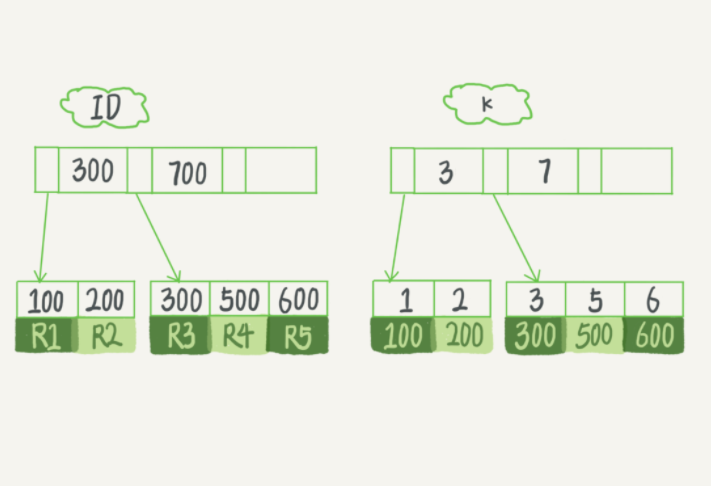
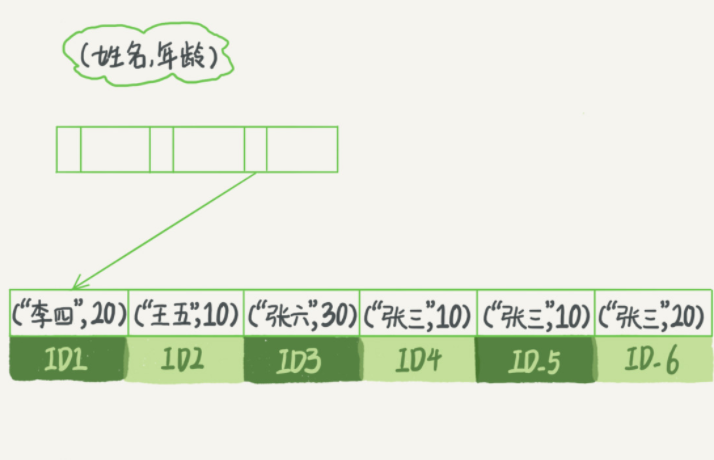

# 索引

索引有什么用？给一个字段加上索引可以提升查找效率。例如，书籍的目录，先确定目标内容在第几页，然后再去翻就容易多了。

## 索引模型

索引的实现方式有很多种，其主要目的都是为了提高查找效率。其底层数据结构有很多种，比较常见的又哈希表，数组和树。

*脑补一下这三种数据结构的图形。*

#### 哈希表

哈希表是以（key，value）的形式进行存储，只要输入待查找的 key 就可以找到对应的值 value 。这样的好处是增添时效率非常高，但是**只适合等值查询的场景**。因为并不是按着主键的递增进行排序的，而是计算key 的哈希值，然后放入计算出来的位置。

```mysql
mysql> select * from t where id = 1;
```

如果要是查询区间的话，只能扫描全表了。

```mysql
mysql> select * from t where id between 1 and 10
```

#### 有序数组

针对哈希表的情况，有序数组在等值查询和范围查询场景中的性能就都非常好。

范围查询的时候，先用二分法找到区间最小值（如果没有最小值就找到大于最小的第一个），然后再向右遍历，直到遇到第一个大于区间最大值的值，结束循环。

对于查询来说，数组的是很好的数据结构，但是在更新数据的时候就麻烦了，每次都要挪动更新数据的后面所有数据，成本太高。所以，**有序数组只适合静态存储引擎**。比如上个月的工资情况，这样的数据是不会再更改的。

#### 树

树的话有很多种，这里 InnoDB 使用的是 **B+ 树**。为什么不使用其他树呢，解释一下：

二叉树搜索树，这个树的时间复杂度是O（logn）。如果运气不好就是一条链表，所以就要保持树的平衡——平衡二叉树。但是又有一个问题，大量数据的话，平衡二叉树会很高，一棵 100 万节点的平衡二叉树，树高 20。一次查询可能需要访问 20 个数据块。在机械硬盘时代，从磁盘随机读一个数据块需要 10 ms 左右的寻址时间。也就是说，对于一个 100 万行的表，如果使用二叉树来存储，单独访问一个行可能需要 20 个 10 ms 的时间。

为了让一个查询更少的读磁盘，访问尽量少的数据块，这就要减少树高，采用 N 叉树。

## InnoDB的索引模型

在 InnoDB 中，**表都是根据主键顺序以索引的形式存放的**，这种存储方式的表称为索引组织表。又因为前面我们提到的，InnoDB 使用了 B+ 树索引模型，所以数据都是存储在 B+ 树中的。

现在我们有个表

```mysql
mysql> create table T(
id int primary key, 
k int not null, 
name varchar(16),
index (k))engine=InnoDB;
```

id 主键，k 索引。

表中 R1~R5 的 (ID,k) 值分别为 (100,1)、(200,2)、(300,3)、(500,5) 和 (600,6)，两棵树的示例示意图如下。



从图中看出，索引分为主键索引和非主键索引。

主键索引的叶子节点存储的是数据行的内容。在 InnoDB 里，主键索引也被称为聚簇索引（clustered index）。

非主键索引的叶子节点存储的是主键的值。在 InnoDB 里，非主键索引也被称为二级索引（secondary index）。

那 主键索引 和 非主键索引 的查询有什么区别呢？

1. 如果语句是 select * from T where ID=500，即主键查询方式，则只需要搜索 ID 这棵 B+ 树；

2. 如果语句是 select * from T where k=5，即普通索引查询方式，则需要先搜索 k 索引树，得到 ID 的值为 500，再到 ID 索引树搜索一次。这个过程称为回表。

   也就是说，基于非主键索引的查询需要多扫描一棵索引树。因此，我们在应用中应该尽量使用主键查询。

由于查询结果所需要的数据只在主键索引上有，所以不得不回表。那么，有没有可能经过索引优化，避免回表过程呢？

## 覆盖索引

如果执行的语句是 select ID from T where k between 3 and 5，这时只需要查 ID 的值，而 ID 的值已经在 k 索引树上了，因此可以直接提供查询结果，不需要回表。也就是说，在这个查询里面，索引 k 已经“覆盖了”我们的查询需求，我们称为覆盖索引。

**由于覆盖索引可以减少树的搜索次数，显著提升查询性能，所以使用覆盖索引是一个常用的性能优化手段。**

*PS：如果某几个字段查询很频繁，建议使用联合索引*

## 最左前缀

B+ 树这种索引结构，可以利用索引的“最左前缀”，来定位记录。

为了直观地说明这个概念，我们用（name，age）这个联合索引来分析。



这里，索引是按顺序已经排好了顺序。

当你的逻辑需求是查到所有名字是“张三”的人时，可以快速定位到 ID4，然后向后遍历得到所有需要的结果。

如果你要查的是所有名字第一个字是“张”的人，你的 SQL 语句的条件是"where name like ‘张 %’"。这时，你也能够用上这个索引，查找到第一个符合条件的记录是 ID3，然后向后遍历，直到不满足条件为止。

## 索引下推

上一段我们说到满足最左前缀原则的时候，最左前缀可以用于在索引中定位记录。这时，你可能要问，那些不符合最左前缀的部分，会怎么样呢？

我们还是以市民表的联合索引（name, age）为例。如果现在有一个需求：检索出表中“名字第一个字是张，而且年龄是 10 岁的所有男孩”。那么，SQL 语句是这么写的：

```mysql
mysql> select * from tuser where name like '张%' and age=10 and ismale=1;
```

先去找 所有姓张的，第一个满足的是 ID3，然后再根据 age 找到满足 10的。最后在去主键 B+ 树找到男性条件。减少了回表次数。

在MySQL 5.6 之前 只能通过回表的方式去找到数据行。

而 MySQL 5.6 引入的索引下推优化（index condition pushdown)， 可以在索引遍历过程中，对索引中包含的字段先做判断，直接过滤掉不满足条件的记录，减少回表次数。

## 索引维护

B+ 树为了维护索引有序性，在插入新值的时候需要做必要的维护。以上面这个图为例，如果插入新的行 ID 值为 700，则只需要在 R5 的记录后面插入一个新记录。如果新插入的 ID 值为 400，就相对麻烦了，需要逻辑上挪动后面的数据，空出位置。

而更糟的情况是，如果 R5 所在的数据页已经满了，根据 B+ 树的算法，这时候需要申请一个新的数据页（page），然后挪动部分数据过去。这个过程称为**页分裂**。在这种情况下，性能自然会受影响。

由于页分裂，所以空间利用率也减少了50%。有分裂就有合并，页合并的过程是逆过程。

*注：自增主键可以避免页分裂，而逻辑删除可以避免页合并。*

[InnoDB 页分裂和页合并的解释](https://zhuanlan.zhihu.com/p/98818611) 

~~不想看链接的话，其实就是页内部有一个属性（MERGE_THRESHOLD）它值是整个页中的 1/2，如果当前页还可以继续放数据，按顺序填满页；若页已经填满下一行记录就记录在next页中；~~

~~页分裂的话，就是当前页有空位，但是不足以放下下一行数据了（此行太大），结果下一行也没有位置放下它，就新建一页，判读分裂位置，移动数据，重新定义页之间关系。~~

~~页分裂会发生在插入或更新，并且造成页的错位（dislocation，落入不同的区）~~

~~合并的话就是，删除数据了，标记删除的数据，然后会开始寻找最靠近的页（前或后）看看是否可以将两个页合并以优化空间使用。**占用太长篇幅了**~~


#### 小结

介绍了 InnoDB 采用的 B+ 树结构，以及为什么 InnoDB 要这么选择。B+ 树能够很好地配合磁盘的读写特性，减少单次查询的磁盘访问次数。数据库索引的概念，包括了覆盖索引、前缀索引、索引下推。你可以看到，在满足语句需求的情况下， 尽量少地访问资源是数据库设计的重要原则之一。我们在使用数据库的时候，尤其是在设计表结构时，也要以减少资源消耗作为目标。

##### 思考题

```mysql
#重建主键索引
alter table T drop index k;
alter table T add index(k);

#重建主键索引
alter table T drop primary key;
alter table T add primary key(id);
```

对于上面这两个重建索引的作法，如果有不合适的，为什么，更好的方法是什么？

答：每个索引对应自己的 B+ 树，修改主键索引会导致 k 的 B+ 树也要进行重构，性能消耗太大。 普通索引影响不大，不过要避免影响业务。


```mysql
CREATE TABLE `geek` (
  `a` int(11) NOT NULL,
  `b` int(11) NOT NULL,
  `c` int(11) NOT NULL,
  `d` int(11) NOT NULL,
  PRIMARY KEY (`a`,`b`),
  KEY `c` (`c`),
  KEY `ca` (`c`,`a`),
  KEY `cb` (`c`,`b`)
) ENGINE=InnoDB;
```

创建了主键索引 （a，b），索引c ，索引（c，a），索引（c，b），哪些索引是没有必要的？

答：主键索引（a,b）先排a再排b；（c）索引的 B+ 树排序是先排 c 再排主键索引 (a,b)；(c,a) 索引先排序 c 再排序 a 最后排主键 b；（c,b）索引先排序 c 再排序 b 最后排主键 a 。 所以，ca 和 c 顺序是一样的，ca 是没有必要的。