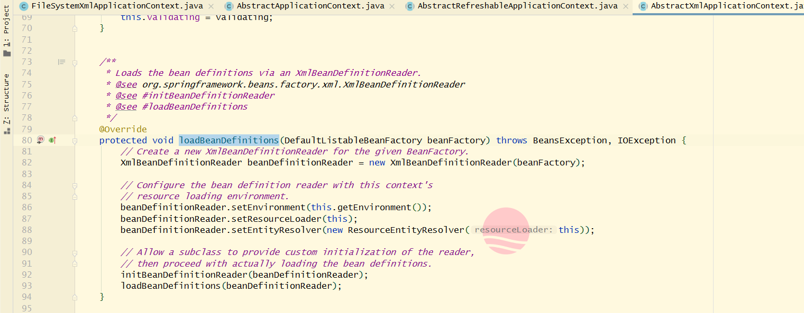

# TODO

写不下去了，关系理乱了。

## IoC容器的初始化过程

​		简单来说，**IoC容器的初始化**是由`refresh()`方法来启动的，**`这个方法标志着IoC容器的正式启动`**。整个启动过程：**BeanDefinition**的**Resource**`定位`、`载入`和`注册`。

​		Spring把这三个过程分开，用不同的模块来完成，ResourceLoader、BeanDefinitionReader等。这样可以灵活地对三个过程进行剪裁或扩展，定义出适合自己的IoC容器的初始化过程。

​		第一个是`Resource定位过程`，就相当于，打水先找到水源。这个**Resource定位是BeanDefinition的资源定位**，由ResourceLoader同意的Resource接口完成，Resource对各种形式的BeanDefinition的使用都统一了接口。因为BeanDefinition在**文件系统**里Bean使用`FileSystemResource`，在**类路径**里使用`ClassPathResource`，等等。

​		第二个是`BeanDefinition的载入`。这个载入过程就是把（用户）定义好的Bean表示成IoC容器内的数据结构，这个容器内部的数据结构就是BeanDefinition。**简单理解就是BeanDefinition里面封装好了Bean的所有数据**。

​		第三个是`IoC容器注册BeanDefinition`。这个过程是通过调用`BeanDefinitionRegistry`接口实现完成的。这个注册过程把载入过程中解析得到的BeanDefinition向容器进行注册。**IoC容器内部将BeanDefinition注入到一个HashMap中去**，IoC容器就是**通过这个HashMap来持有这些BeanDefinition数据**。

​		初始化的过程一般不包含Bean依赖注入的实现。载入和依赖注入是两个独立的过程。依赖注入一般发生在应用第一次通过`getBean`向容器索取的时候。`注：` 一个例外，使用IoC容器的时候有一个预实例化的配置，通过更改这个配置（**lazyinit**），在容器初始化的时依赖注入就预先完成了，不需要等整个初始化完成。


## BeanDefinition的Resource定位

​		以`FileSystemXmlApplicationContext`为例，首先来看下继承体系 ↓


​		**FileSystemXmlApplicationContext**通过继承AbstractApplicationContext具备了ResourceLoader读入以Resource定义的BeanDefinition因为AbstractApplicationContext的父类是DefaultResourceLoader。

FileSystemXmlApplicationContext的实现：

```java
package org.springframework.context.support;

import org.springframework.beans.BeansException;
import org.springframework.context.ApplicationContext;
import org.springframework.core.io.FileSystemResource;
import org.springframework.core.io.Resource;


public class FileSystemXmlApplicationContext extends AbstractXmlApplicationContext {

	
	public FileSystemXmlApplicationContext() {
	}

	public FileSystemXmlApplicationContext(ApplicationContext parent) {
		super(parent);
	}
	//configLocation是BeanDefinition的文件所在路径
	public FileSystemXmlApplicationContext(String configLocation) throws BeansException {
		this(new String[] {configLocation}, true, null);
	}

	public FileSystemXmlApplicationContext(String... configLocations) throws BeansException {
		this(configLocations, true, null);
	}
	//可以有多个BeanDefinition文件路径
	public FileSystemXmlApplicationContext(String[] configLocations, ApplicationContext parent) throws BeansException {
		this(configLocations, true, parent);
	}

	public FileSystemXmlApplicationContext(String[] configLocations, boolean refresh) throws BeansException {
		this(configLocations, refresh, null);
	}
	//在对象初始化的过程中，调用refresh载入BeanDefinition,启动了BeanDefinition载入过程。
	public FileSystemXmlApplicationContext(String[] configLocations, boolean refresh, ApplicationContext parent)
			throws BeansException {

		super(parent);
		setConfigLocations(configLocations);
		//通过 refresh() 来定位BeanDefinition资源的过程。
		if (refresh) {
			refresh();
		}
	}
    //应用于文件系统中的Resource实现，通过构造一个FileSystemResource来得到一个在文件系统中定位的BeanDefinition
	//具体定位实现由各个子类完成
	@Override
	protected Resource getResourceByPath(String path) {
		if (path != null && path.startsWith("/")) {
			path = path.substring(1);
		}
		return new FileSystemResource(path);
	}

}

```

​		在FileSystemXmlApplicationContext中，最重要的就是`refresh()`，它启动了容器的初始化。BeanDefinition资源定位过程，最初是由refresh来触发。


点进refresh()方法，发现调用的是AbstractApplicationContext类里的refresh方法，在这里通过obtainFreshBeanFactory()里的refreshBeanFactory()来创建一个IoC容器给ApplicationContext使用,对应的方法是`createBeanFactory()`


看一下createBeanFactory的具体做了哪些

```java
protected DefaultListableBeanFactory createBeanFactory() {
		//getInternalParentBeanFactory() 根据自己已有的双亲容器获取DefaultListableBeanFactory的双亲IoC容器
		return new DefaultListableBeanFactory(getInternalParentBeanFactory());
	}
```

然后同时调用（XmlBeanDefinitionReader的）loadBeanDefinitions 读取BeanDefinition信息。此时交给AbstractXmlApplicationContext来处理，**在这里创建了读取器——XmlBeanDefinitionReader**，


因为是Xml所以找Xml的读取器；


