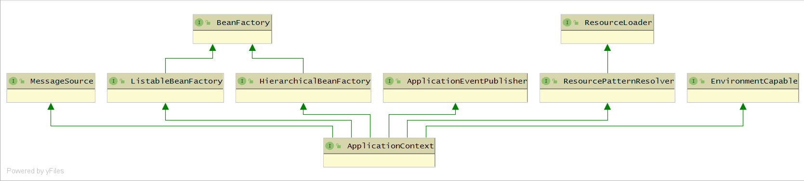

## Spring设计目标

​		Spring的设计目标是为开发人员提供`一站式的轻量级`开发框架。在应用开发的过程中，会设计复杂的对象耦合关系，通过Spring的`IoC容器`实现依赖反转，把依赖关系的管理从Java对象中解放，交给Spring的`IoC容器`来管理，从而实现对象直接的关系解耦。 从原来的 `对象—对象` 关系，转化为 `对象—IoC容器—对象` 关系。而且Spring还是一个非入侵性框架，在没有Spring其他容器的情况下也可以运行，对框架的依赖降到最小。

## Spring IoC容器

### IoC概述

​		**IoC——控制反转**，哪些控制被反转了？ 依赖对象关系的管理被反转了。相当于对象的创建控制权交给容器来管理，核心理念就是 `依赖注入`。例如：比较复杂的应用都是由两个或者两个以上的**类**彼此依赖实现业务逻辑（在A类里 new 一个B），如果这个过程要靠自身实现，会导致代码高度耦合。

​		依赖关系靠IoC容器来管理，将这些以来关系注入到组件中，具体的注入方式有：`接口注入`、`setter注入（主要、常见）`和`构造器注入（主要）`，防止注入异常，还有特定依赖的检查。

### IoC容器的实现：BeanFactory 和 ApplicationContext

​		**BeanFactory**接口 是一个简单容器系列，只实现了容器的最基本功能，而**ApplicationContext**应用上下文 是容器的高级形态，在简单容器的基础上增加了许多面向框架的特性。

​		Spring为开发者提供了许多容器，只是功能不同。以电脑为例，电脑有大有小，操作系统也不同，但首先一点，他可以存储文件，可以上网，这是电脑最基本的功能。BeanFactory就定义了电脑的基本功能，至少可上网。除了满足最基本的需求外，还可以手提式和台式的，满足特定的场景需要。

​		下图所示的是IoC容器接口的设计。

​		从BeanFactory到HierarchicalBeanFactory这条线，BeanFactory定义了基本的IoC容器规范，HierarchicalBeanFactory继承了BeanFactory之后，还增加getParentBeanFactory() 的接口功能。

​		从ApplicationContext接口为核心的接口设计，细化了很多BeanFactory的接口功能，而且通过对ResourceLoader、MessageSource、ApplicationEventPublisher接口的继承，在BeanFactory简单IoC容器的基础上添加了许多高级容器的特性支持。

### 区分 FactoryBean和BeanFactory

​		FactoryBean和BeanFactory， 一个是工厂，容器 或者 对象 工厂；一个是Bean。所有的Bean都是BeanFactory来进行管理，FactoryBean不是简单的Bean，而是一个产生对象生成的工厂Bean，它的设计模式是工厂模式。

#### ApplicationContext

​		ApplicationContext具备了BeanFactory不具备的新特性。

- 支持不同的信息源。ApplicationContext扩展了MessageSource接口，所以，这些扩展功能可以支持国际化。

- 访问资源。体现在了对ResourceLoader和Resource的支持上，可以从不同地方得到Bean定义资源。

- 支持应用事件。继承了接口ApplicationEventPublisher，从而引入了事件机制。

  