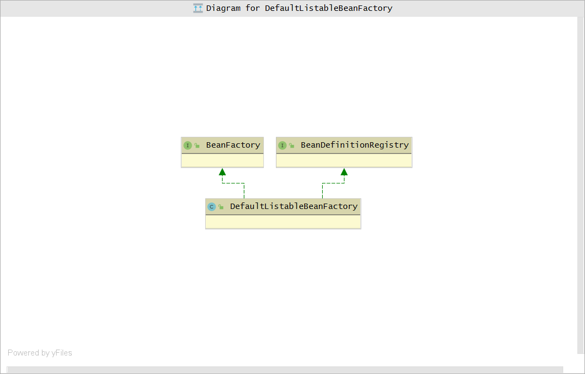

# Spring

## Spring 历史

在EJB企业级应用开发（重量级）的时代，2003年Spring横空出世（轻量级Java开发框架），Spring框架的出现为曾经阴霾的天空带来了灿烂的阳光。  
EJB 和 Spring 之间的比较，为了减少篇幅长度，可以搜索一下Spring 更详细的发展历史。

## Spring 概述

Spring框架所倡导的基于POJO（Plain Old Java Object，简单Java对象）的轻量级开发理念，就是从实际出发，立足于最基础的POJO。组成整个Spring框架的各种服务实现被划分到了多个相互独立却又相互依赖的模块当中。例如，aop、core、web、dao、orm..... Spring 提供了IoC容器，帮助我们以依赖注入的方式管理对象之间的依赖关系。

spring的生态非常庞大，比如出名的产品 Spring Security、Spring MVC等。

## IoC 基本概念

IoC（Inversion of Control，控制反转） 一种轻量级容器，经常听到的`依赖注入`（Dependency Injection）说的也是它。  
反转的是什么呢，其实就是将对象的创建管理权交给了框架。在生活中，平常你吃饭穿衣，都是自己去吃、去穿，这些都是由自己去实现；

这就传统获取依赖对象的方式，需要什么对象`new` 什么对象。

```java
class Help {
    private Eat e;
    public Help () {
        e = new Eat();
    }
}
class Do {
    public static void main(String args[]) {
        Help h = new Help();
        #TODO
    }
}
```

换一个场景：假如你是一个富得流油的人，你吃饭穿衣都是雇人来做，那么所有事情不需要自己动手了，交给别人来完成。

```java
class Help {
    private Eat e;
    //构造器注入
    public Help (Eat e) {
        this.e = e;
    }
}
class Do {
    public static void main(String args[]) {
        Help h = new Help(new Eat);
        #TODO
    }
}
```

我们自己每次用到什么依赖对象都要主动地去获取，这是否真的必要？我们最终所要做的，其实就是直接调用依赖对象所提供的某项服务而已。只要用到这个依赖对象的时候，它能够准备就绪，我们完全可以不管这个对象是自己找来的还是别人送过来的。  
谈到了构造器注入，那就说说注入方式吧  ↓

### 构造器注入

这种方式注入的缺点就是不管用不用，先全部准备好。

```java
class Demo {
    private Instance1 i1;
    private Instance2 i2;
    
    public Demo (Instance1 i1, Instance2 i2) {
        this.i1 = i1;
        this.i2 = i2;
    }
}
```

### setter注入

```java
class Demo {
    private Instance1 i1;
    private Instance2 i2;
    
    public Demo getI1 () {
        return i1;
    }
    public Demo setI1 (Instance1 i1) {
        this.i1 = i1;
    }
    
    public Demo getI2 () {
        return i1;
    }
    public Demo setI2 (Instance1 i2) {
        this.i2 = i2;
    }
}
```

setter注入随意性强，想什么时候注入再注入。缺点就是无法创建完对象立马进入就绪状态。

### 接口注入

[小栗子](https://www.iteye.com/blog/ghl116-1474250)  
这个方式用的很少，几乎“退役”了。

所以，IoC的主要干的活就是，**业务对象的创建管理** 和 **业务对象直接的依赖绑定**。

那IoC如何确定对象直接的依赖关系？比如 **文本文件**、**XML文件**...

### Java 方式

这种就是在容器启动前，通过Java代码将注入对象和以来对象注册到容器中，明确了他们之间的依赖注入关系。

```java
Container c = getContainer();
c.register(Help.class, new Help());
Help h = (Help)c.get(Help.class);
#TODO
```

在我们需要的某类型对象的时候，容器将注册好的对应具体实例返回给我们。

### 配置文件方式

在XML文件中，描述好对象所对应的依赖关系。

```xml
<bean id="help" class="xxx.Help"> 
 <property name="h"> 
 <ref bean="help"/> 
 </property> 
</bean> 

<bean id="eat" 
 class="..impl.Eat"> 
</bean>
```

### 注解方式

就是@Autowire，@Bean这些....需要@CompontScan扫描对应的包。

## BeanFactory 与 Application

Spring提供了两种容器类型：`BeanFactory`和`ApplicationContext`。

**BeanFactory：**简单的IoC容器。默认采用的是延迟加载策略（Lazy-load），功能要求不是很严格的场景下，BeanFactory是比较合适的IoC容器选择。

**Application：**高级的IoC容器。由下图可见，Application在BeanFactory基础之上构建的，还支持其他特性，比如事件发布，消息源，国际化等。在该类型容器启动之后，默认是全部初始化。所以，相对于BeanFactory来说，ApplicationContext要求更多的系统资源，同时，因为在启动时就完成所有初始化，容器启动时间较之BeanFactory也会长一些。在复杂的场景中使用Application是比较好的选择。

图，展示BeanFactory与Application关系。


### BeanFactory

BeanFactory 的定义：

```java
public interface BeanFactory {
	
	String FACTORY_BEAN_PREFIX = "&";

    //获取Bean
	Object getBean(String name) throws BeansException;

	<T> T getBean(String name, Class<T> requiredType) throws BeansException;

	Object getBean(String name, Object... args) throws BeansException;

	<T> T getBean(Class<T> requiredType) throws BeansException;

	<T> T getBean(Class<T> requiredType, Object... args) throws BeansException;

    //容器是否存在Bean
	boolean containsBean(String name);

    //是否单例
	boolean isSingleton(String name) throws NoSuchBeanDefinitionException;

    //是否原型
	boolean isPrototype(String name) throws NoSuchBeanDefinitionException;

    //类型
	boolean isTypeMatch(String name, ResolvableType typeToMatch) throws NoSuchBeanDefinitionException;

	boolean isTypeMatch(String name, Class<?> typeToMatch) throws NoSuchBeanDefinitionException;

	Class<?> getType(String name) throws NoSuchBeanDefinitionException;

    //别名
	String[] getAliases(String name);
}
```

BeanFactory见名知意，用于生产Bean，原来需要我们自己获取对象，现在这个过程由BeanFactory给我们提供；和工厂一样，交给图纸，它就能照着生产出东西来了，至于怎么做的，不需要我们知道。

### 直接编码方式

```java
class FXNews {
	public static void main(String[] args) {
     //Spring默认使用的IoC容器
     DefaultListableBeanFactory beanRegistry = new DefaultListableBeanFactory(); 
     //获取容器
     BeanFactory container = (BeanFactory)bindViaCode(beanRegistry); 
     //从容器中获取Bean
     FXNewsProvider newsProvider = (FXNewsProvider)container.getBean("djNewsProvider");
     //干活
     newsProvider.getAndPersistNews(); 
    }
    //对象注册和相关依赖管理 这里有个BeanDefinition 它是Spring内部的一种数据结构
    public static BeanFactory bindViaCode(BeanDefinitionRegistry registry) { 
     AbstractBeanDefinition newsProvider = new RootBeanDefinition(FXNewsProvider.class,true); 
     AbstractBeanDefinition newsListener = new RootBeanDefinition(DowJonesNewsListener.class,true); 
     AbstractBeanDefinition newsPersister = new RootBeanDefinition(DowJonesNewsPersister.class,true); 
     // 将bean定义注册到容器中
     registry.registerBeanDefinition("djNewsProvider", newsProvider); 
     registry.registerBeanDefinition("djListener", newsListener); 
     registry.registerBeanDefinition("djPersister", newsPersister); 
    // 指定依赖关系
     // 1. 可以通过构造方法注入方式
     ConstructorArgumentValues argValues = new ConstructorArgumentValues(); 
     argValues.addIndexedArgumentValue(0, newsListener); 
     argValues.addIndexedArgumentValue(1, newsPersister); 
     newsProvider.setConstructorArgumentValues(argValues); 
     // 2. 或者通过setter方法注入方式
     MutablePropertyValues propertyValues = new MutablePropertyValues(); 
     propertyValues.addPropertyValue(new ropertyValue("newsListener",newsListener)); 
     propertyValues.addPropertyValue(new PropertyValue("newPersistener",newsPersister)); 
     newsProvider.setPropertyValues(propertyValues); 
     // 绑定完成
     return (BeanFactory)registry; 
    }
}
```

*上面小栗子来自《揭秘》*

*“打个比方说，BeanDefinitionRegistry就像图书馆的书架，所有的书是放在书架上的。虽然你还书或者借书都是跟图书馆（也就是BeanFactory，或许BookFactory可能更好些）打交道，但书架才是图书馆存放各类图书的地方。所以，书架相对于图书馆来说，就是它的“BookDefinitionRegistry”。”——《揭秘》*

DefaultListableBeanFactory是实现了**BeanDefinitionRegistry**和**BeanFactory**的，基本上BeanFactory接口只定义如何访问容器内管理的Bean的方法，BeanDefinitionRegistry接口定义抽象了Bean的注册逻辑。

图，DefaultListableBeanFactory与BeanDefinitionRegistry和BeanFactory继承关系



### 外部配置文件方式

Spring的IoC容器支持两种配置文件格式：**Properties**文件格式和**XML**文件格式。采用外部配置文件时，Spring的IoC容器有一个统一的处理方式。通常情况下，需要根据不同的外部配置文件格式，给出相应的**BeanDefinitionReader**实现类。**BeanDefinitionReader**的相应实现类负责将相应的配置文件内容读取并映射到**BeanDefinition**，然后将映射后的**BeanDefinition**注册到一个**BeanDefinitionRegistry**，之后，**BeanDefinitionRegistry**即完成Bean的注册和加载。

大部分工作，包括解析文件格式、装配BeanDefinition之类的工作，都是由**BeanDefinitionReader**的相应实现类来做的。**BeanDefinitionRegistry**只不过负责保管而已。整个过程类似于：

```java
BeanDefinitionRegistry beanRegistry = <某个BeanDefinitionRegistry实现类，通常为DefaultListableBeanFactory>; 
BeanDefinitionReader beanDefinitionReader = new BeanDefinitionReaderImpl(beanRegistry); 
beanDefinitionReader.loadBeanDefinitions("配置文件路径"); 
// 现在我们就取得了一个可用的BeanDefinitionRegistry实例
```

XML配置的方式就是，在XML文件中定义bean

```xml
<?xml version="1.0" encoding="UTF-8"?> 
<!DOCTYPE beans PUBLIC "-//SPRING//DTD BEAN//EN" 
"http://www.springframework.org/dtd/spring-beans.dtd"> 
<beans> 
 <bean id=" " class=".. "> 
 <constructor-arg index="0"> 
 <ref bean=" "/> 
 </constructor-arg> 
 <constructor-arg index="1"> 
 <ref bean=" "/> 
 </constructor-arg> 
 </bean> 
 
 <bean id=" " class=" "> 
 </bean> 
 <bean id=" " class=" "> 
 </bean> 
</beans>
```


### 注解方式

注解方式非常简单

```java
@Component
class Study {
    @Autowire
    private Student s;
    @Autowire
    private Teacher t;
    
    #TODO
}
```

**@Autowire**告知Spring为当前对象注入哪些依赖对象。**@Component**则是配合classpath-scanning使用

```xml
<?xml version="1.0" encoding="UTF-8"?> 
<beans xmlns="http://www.springframework.org/schema/beans" 
xmlns:xsi="http://www.w3.org/2001/XMLSchema-instance" 
xmlns:context="http://www.springframework.org/schema/context" 
xmlns:tx="http://www.springframework.org/schema/tx" 
xsi:schemaLocation="http://www.springframework.org/schema/beans 
http://www.springframework.org/schema/beans/spring-beans-2.5.xsd 
http://www.springframework.org/schema/context 
http://www.springframework.org/schema/context/spring-context-2.5.xsd 
http://www.springframework.org/schema/tx 
http://www.springframework.org/schema/tx/spring-tx-2.5.xsd"> 
<context:component-scan basepackage="cn.spring21.project.base.package"/> 
</beans>
```

`<context:component-scan/>`会到指定的包下面扫描标注有@Component的类，如果找到，则将它们添加到容器进行管理，并根据它们所标注的@Autowired为这些类注入符合条件的依赖对象。

