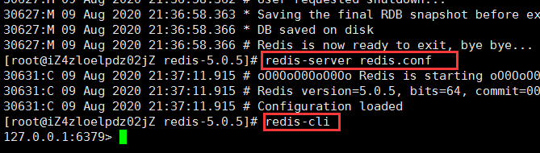

## Redis 入门

#### 简单介绍

**Redis**：开源、免费、非关系型数据库、K-V数据库、内存数据库，支持持久化、事务和备份，集群(支持16个库)等高可用功能。并且性能极高(可以达到100000+的QPS)，易扩展，丰富的数据类型，所有操作都是单线程,原子性的。

**NoSQL**：非关系型数据库，数据与数据之间没有关联关系。就是为了解决大规模数据集合多重数据种类带来的挑战，尤其是大数据应用难题。

类型

1. 键值(key-value)存储数据库
2. 列存储数据库：键仍然存在，但是指向了多个列，HBase (eg：博客平台(标签和文章)，日志)
3. 文档型数据库 MongoDb  (eg：淘宝商品的评价)
4. 图形数据库 Neo4j  （eg：好友列表）

> 扩展:
>
> MongoDB是一个基于分布式文件存储的数据库。有C++语言编写。旨在为WEB应用提供可扩展的高性能数据存储解决方案。
>
> MongoDB是一个介于关系型数据库和非关系型数据库之间的产品，是非关系数据库当中功能最丰富，最像关系型数据库的。
>
> 文档(document)是MongoDB中数据的基本单元，非常类似于关系型数据库系统中的行(但是比行要复杂的多);
> 集合(collection)就是一组文档，如果说MongoDB中的文档类似于关系型数据库中的行，那么集合就如同表;

使用场景:

1. 数据模型比较简单。
2. 需要灵活更强的IT系统。
3. 对数据库性能要求比较高。
4. 不需要高度的数据一致性。
5. 对于给定的key，比较容易映射复杂值的环境。

**SQL**:关系型数据库，表与表之间建立关联关系。

#### Redis 安装

学习Redis之前，首先要拥有它！所以，先去<a href="http://www.redis.cn/download.html">redis的中文官网</a>下载安装包redis-5.0.5版本；最好选择稳定版本。在下载的时候别闲着，去下载一个xshell，这个软件是连接Linux的一个终端，redis的使用在linux下是最好的。由于我是买了阿里云的云服务器，所以不需要下载虚拟机安装linux系统了，如白嫖党还是老老实实用虚拟机吧。此时下载完毕，就将`redis-5.0.5.tar.gz`安装包传入Linux下，传输完毕，输入以下命令**查看当前目录下的文件**

```shell
[root@iZ4zloelpdz02jZ ~]# ll
```


```shell
#解压redis-5.0.5的安装包
[root@iZ4zloelpdz02jZ ~]# tar xzf redis-5.0.5.tar.gz

#然后进入redis-5.0.5 文件夹
[root@iZ4zloelpdz02jZ ~]#  cd redis-5.0.5

#编译
[root@iZ4zloelpdz02jZ redis-5.0.5]# make
#若编译失败则缺少编译环境 输入如下命令
[root@iZ4zloelpdz02jZ redis-5.0.5]# yum install gcc-c++
#编译成功后 安装
[root@iZ4zloelpdz02jZ redis-5.0.5]# make install
```


```shell
#进入到解压后的 src 目录，通过如下命令启动Redis
[root@iZ4zloelpdz02jZ redis-5.0.5]# src/redis-server
#如下情况 ctrl c 退出
```


```shell
#从配置文件里修改
[root@iZ4zloelpdz02jZ redis-5.0.5]# vim redis.conf
```


找到如下内容进行修改


再次连接服务`redis-server redis.conf `，连接redis客户端 `redis-cli `



此时，连接成功。  
退出客户端与服务输入`shutdown`，即退出。

#### docker 安装 redis

```shell
#拉取镜像
docker pull redis
#挂载数据卷并运行容器
docker run -p 6379:6379 --name redis -v /root/redis/data:/data -v /root/redis/conf/redis.conf:/usr/local/etc/redis/redis.conf -d redis redis-server /usr/local/etc/redis/redis.conf --appendonly yes --requirepass "xxx"
```

## Redis 基本命令

```shell
#设置一个key为a value 为 2
set a 2
#查询key为a 的value
get a
#进入 1
select 1
#查询db当前所有key
keys *
#增1 
incr a 
-> 显示 3 因为2+1=3
#减1
decr a
-> 2 , 3-1=2
#查询db长度
dbsize
-> 1 只有a一个key
#删除
del a
#设置过期时间 给key=a设置10秒后过期
expire a 10 
#查看有效时间 
ttl
```

#### String

*SDS*

```shell
#拼接
append a "b"
#查看字符长度
strlen a
#如果key存在不动，不存在设置abc
setnx a "abc"
#设置多个键值对
mset k1 v1 k2 v2 k3 v3
#得到多个键值
mget k1 k2 k3
#与setnx 同理
msetnx k1 v11
#获得取值范围内的内容 与 substring 类似
getrange a <start> <end>
-> (a,123456) 截取后0-4：12345
#为key覆值，覆盖的覆
setrange <key> <start> <value>
#设置过期时间，直接在创建的时候设置
setex <key> <seconds> <value>
#设置新值，获取旧值
getset <key> <value>
```

#### List

*压缩列表 + 双端链表*

```shell
#添加
lpush <key> <values>
rpush ..	..
#弹出 
lpop  ..
rpop  ..
#按照索引获取元素（左->右）
lrange <key> <start> <end>
#按照索引下标获取元素
lindex <key> <index>
#获取列表长度
llen <key>
#在value前面或后面插入newvalue
linsert <key> before|after <value> <newv>
#从左边删除n个value（左->右>
lrem <key> <n> <value>
```

#### hash

*Hash表 + 压缩列表*

```shell
hset key_name field value #为指定的key设定field和value

hmset key field value[field1,value1]

hsetnx #当不存在才创建该field

hget key field

hmget key field[field1]

hgetall key #返回hash表中所有字段和值

hkeys key #获取hash表所有字段

hvals key #获取hash表所有值

hlen key #获取hash表中的字段数量

hdel key field [field1] #删除一个或多个hash表的字段

hexists #在key里面是否存在指定的field

hincrby key field increment #增加某个field的值
```

***应用场景***

Hash的应用场景，通常用来存储一个用户信息的对象数据。

​	1、相比于存储对象的string类型的json串，json串修改单个属性需要将整个值取出来。而hash不需要。  
​	2、相比于多个key-value存储对象，hash节省了很多内存空间  
​	3、如果hash的属性值被删除完，那么hash的key也会被redis删除

#### Set

*整数集合 + 哈希表*

```shell
> - sadd key value1[value2] #向集合添加成员
>
> - scard key #返回集合成员数
>
> - smembers key #返回集合中所有成员
>
> - sismember key member #判断memeber元素是否是集合key成员的成员
>
> - srandmember key [count] #返回集合中一个或多个随机数
>
> - srem key member1 [member2] #移除集合中一个或多个成员
>
> - spop key #移除并返回集合中的一个随机元素
>
> - smove source destination member #将member元素从source集合移动到destination集合
>
> - sdiff key1 [key2] #返回给定的第一个集合和其他集合的差集(即在key1中的值而在其他key中找不到)
>
> - sdiffstore destination key1[key2] #返回给定的第一个集合与其他的集合的差集并存储在destination中
>
>   eg：set1：1 2 3   set2：3 4 5 6   sdiffstore set3 set1 set2   smembers set3  result：1 2
>
> - sinter key1 [key2] #返回所有集合的交集
>
> - sunion key1 [key2] #返回所有集合的并集
```

对两个集合间的数据[计算]进行交集、并集、差集运算
	1、以非常方便的实现如共同关注、共同喜好、二度好友等功能。对上面的所有集合操作，你还可以使用不同的命令选择将结果返回给客户端还是存储到一个新的集合中。  
	2、利用唯一性，可以统计访问网站的所有独立 IP。

#### zset

*压缩列表 + 跳越链表*

```shell
> - zadd key score1 memeber1
> - zcard key #获取集合中的元素数量
> - zcount key min max #计算在有序集合中指定区间分数的成员数
> - zcount key min max #计算在有序集合中指定区间分数的成员数
> - zrange key start stop #指定输出索引范围内的成员
> - zrangebyscore key min max #指定输出score区间内的成员

> - zrank key member #返回有序集合指定成员的索引
> - zrevrange key start stop  #返回有序集中指定区间内的成员，通过索引，分数从高到底
> - zrem key member [member …] #移除有序集合中的一个或多个成员
> - zremrangebyrank key start stop #移除有序集合中给定的索引区间的所有成员(第一名是0)(低到高排序）
> - zremrangebyscore  key min max #移除有序集合中给定的分数区间的所有成员
```

常用于排行榜：

​	1、如推特可以以发表时间作为score来存储。  
​	2、存储成绩。  
​	3、还可以用zset来做带权重的队列，让重要的任务先执行。