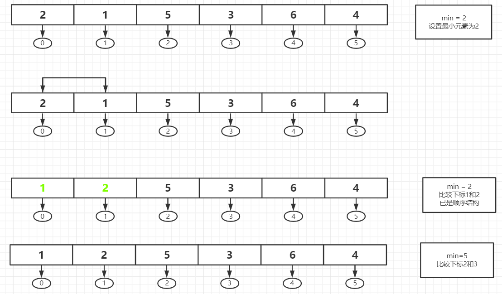
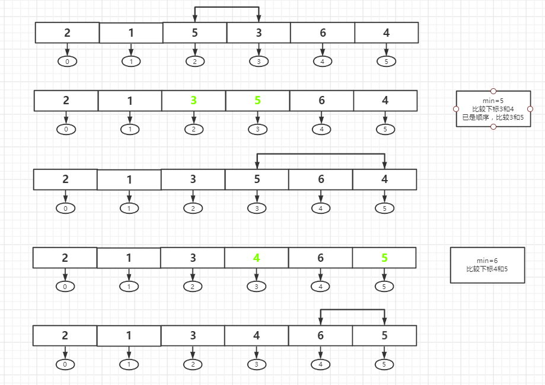
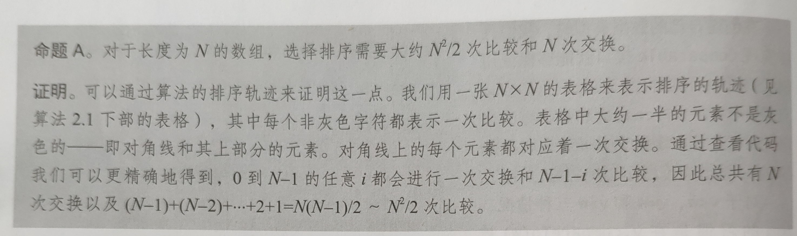
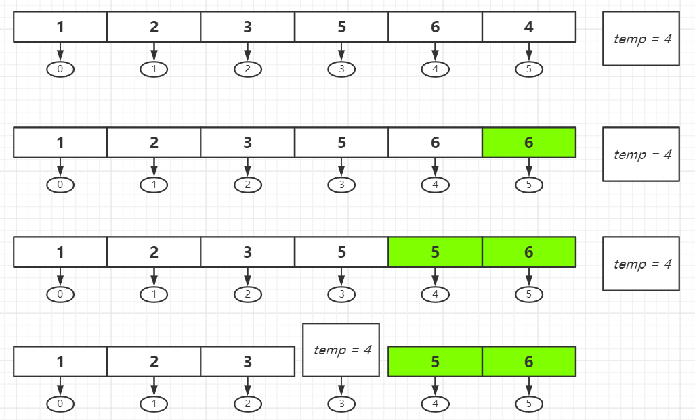
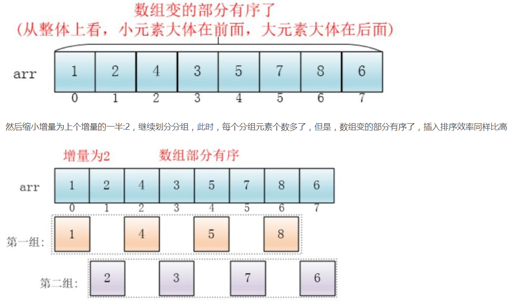
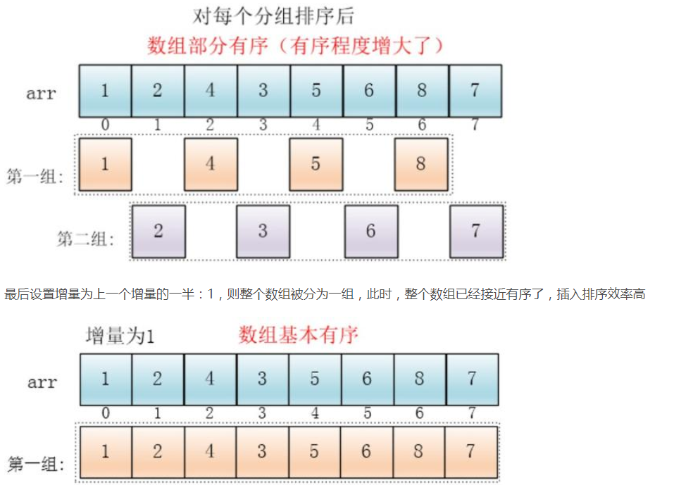
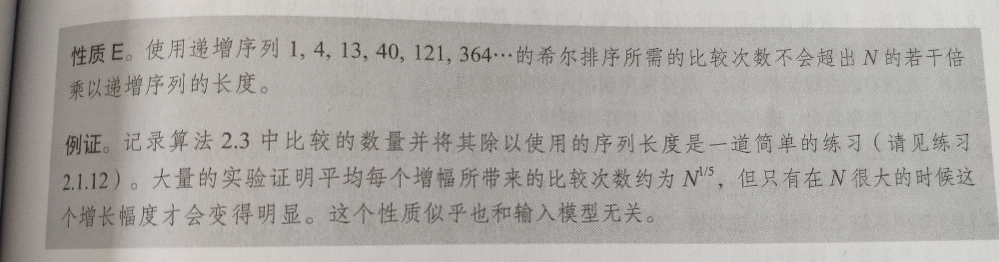
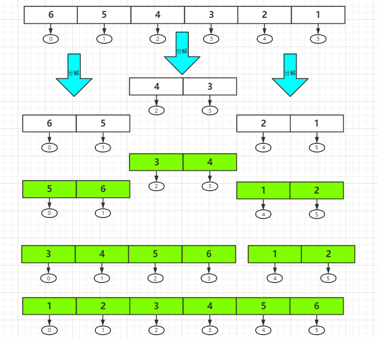
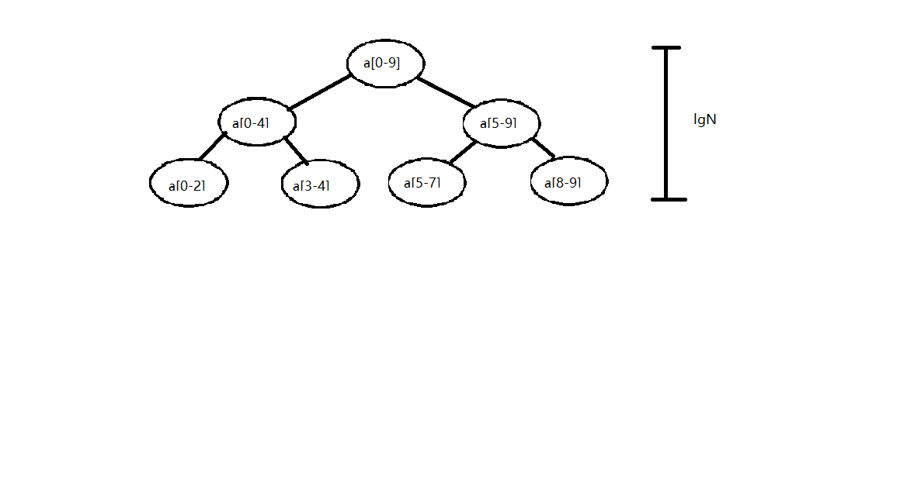

## 排序

#### 选择排序（Selection sort）

一般选择第一个元素为最小元素，和其余元素相比较。若遇到比自身还小的元素，则将此元素设置为最小元素并设置为下表为0的位置。重复此操作直至顺序。

**代码实现**

```java
public class Selection{
	public static void main(String[] args) {
        int temp;
        int a[] = {2,1,5,3,6,4,9,8,7};
        for (int i=0;i<a.length;i++){
            int min = i;
            for (int j=i+1;j<a.length;j++){
                if (a[min]>a[j]){
                    min = j;
                }
            }
            temp = a[min];
            a[min] = a[i];
            a[i] = temp;
        }
        System.out.println(Arrays.toString(a));
    }
}
```

*分析过程如下*：







*出自：《算法》*

#### 插入排序（Insertion sort）

适用于小规模或者基本有序的时时候，其效率比选择排序更高效。

**代码实现**

```java
public class Insertion{
    public static void main(String [] args){
        int arr[] = {2,1,5,3,6,4,9,8,7};
        int temp;
        
        // 升序排列 i=1 从第二个开始
        for(int i=1;i<arr.length;i++){
            // 前一个元素大于后一个元素，则需排序
            if(arr[i-1]>arr[i]){
                // 保存当前这个数，为了和前面的数作比较，看是否大于自身
				temp = arr[i];
                for(int j=i;j>=0;j--){
                    if(j>0 && arr[j-1] > temp){
                        arr[j] = arr[j-1];
                    }esle{
                        arr[j] = temp;
                        break;
                    }
                }
            }
        }
    }
}
------------------------------------------------------------------------------------
输出：
    [1, 2, 3, 4, 5, 6, 7, 8, 9]
```

*分析过程如下*：



​		首先，以==下标==5作为例子。  
​		前一个元素大于自身（6 > 4），则temp 记录4，为了和前面所有元素比较，于是下标为5的元素被前一个元素覆盖。再和下标为3的元素比较（5 > 4），则重复之前操作。和下标2的元素比较（3 < 4），则temp 覆盖 下标 2 之后的元素。


*出自：《算法》*

#### 希尔排序（Shell sort）

插入排序的改进版，使得在大规模或无序的数据也非常有效。  
将大规模数据，分成若干个组，然后对每个组分别进行插入排序，因规模变小，所以效率更高。

**代码实现**

````java
public class Shell {
    public static void main(String[] args) {
        int[]a = {8,9,1,7,2,3,5,4,6,0};
        //递增序列
        int h = 1;
        while (h<a.length/3){
            h = 3*h + 1;
        }
        while (h>=1){
            for (int i = h;i<a.length;i++){
                for (int j = i;j>=h;j-=h){
                    if(a[j]<a[j-h]){
                        int temp = a[j-h];
                        a[j-h] = a[j];
                        a[j] = temp;
                    }
                }
            }
            h = h/3;
        }
        System.out.println(Arrays.toString(a));
    }
}
````




*图片来源于网络，侵删。*



*出自：《算法》*  
希尔排序的复杂度和增量序列是相关的

{1,2,4,8,...}这种序列并不是很好的增量序列，使用这个增量序列的时间复杂度（最坏情形）是O(n^2^)

Hibbard提出了另一个增量序列{1,3,7，...,2^k-1}^，这种序列的时间复杂度(最坏情形)为O(n^1.5^)

Sedgewick提出了几种增量序列，其最坏情形运行时间为O（n^1.3^）,其中最好的一个序列是{1,5,19,41,109,...}

**本人设置的递增序列通常为**:

(3^k^-1)/2	从N/3递减至1

```java
//数组长度
int N = array.length;
//递增序列
int h = 1;
// 1 4 13 40 121 364... 
while(h < N/3){
    h = 3*h+1;
}
```


#### 归并排序（Merge sort）

归并，体现了==分而治之==的思想。将大问题分解成若干个小问题（越小越好），再进行解决。例如无序数组，分解若干个子数组，将若干个子数组进行排序，再归并在一起排序。

**代码实现**：

```java
public class Merge {
    public static void main(String[] args) {
        int []arr = {9,8,7,6,5,4,3,2,1};
        sort(arr);
        System.out.println(Arrays.toString(arr));

    }

    public static void sort(int[] arr){
        //临时数组
        int []temp = new int[arr.length];
        sort(arr,0,arr.length-1,temp);
    }

    /**
     * 分而治之，排序
     * @param arr 原数组
     * @param low 左边界
     * @param high 右边界
     * @param temp 临时数组
     */
    public static void sort(int[] arr, int low, int high, int[] temp){
        if (low<high){
            int mid = low+(high-low)/2;
            //左半部分排序
            sort(arr, low, mid, temp);
            //右半部分排序
            sort(arr,mid+1,high,temp);
            //整体归并排序
            merge(arr,low,mid,high,temp);
        }
    }

    public static void merge(int[] arr, int low, int mid, int high, int[] temp){
        int i = low;//左指
        int j = mid + 1;//右指
        int t = 0;//临时数组下标
        while (i<=mid && j<=high){
            if(arr[i]<=arr[j]){
                temp[t++] = arr[i++];
            }else {
                temp[t++] = arr[j++];
            }
        }
        //保存剩下的数
        while (i<=mid){
            temp[t++] = arr[i++];
        }
        //保存剩下的数
        while (j<=high){
            temp[t++] = arr[j++];
        }
        t=0;
        //从临时数组转移到原数组
        while (low<=high){
            arr[low++] = temp[t++];
        }
    }
}

-------------------------------------------------------------------------------------
输出：
    [1, 2, 3, 4, 5, 6, 7, 8, 9]
```



第一步，分解成若干个子数组。  
第二步，排序，归并。  
第三步，归并成原数组。  
在操作中，要借用一个临时数组，先将顺序的元素存在临时数组，再导入原数组。


递归解决问题




*出自：《算法》*

#### 快速排序（Quick sort）

快速排序是分治的一种。先从下标0位置设置为一个`标准`开始，向右扫描，遇到第一个大于自身的元素则从最后一位向右扫描，遇到第一个小于自身的则交换位置。在此递归下去让`标准`的左边都小于自身，右边都大于自身，直至排序完成。希尔排序和归并排序，无法完成不损耗空间或高效完成排序，需要借助辅助数组，而快速排序，很好的解决了这两个问题，在原有数组操作。

**代码实现**：

```java
public class Quick {
    public static void main(String[] args) {
        int[] arr = {5,3,8,6,7,1,9,2,4};
        sort(arr,0,arr.length-1);
        System.out.println(Arrays.toString(arr));
    }
    public static void sort(int[]arr,int lo,int hi){
        //递归结束
        if(hi<=lo){
            return;
        }
        //获取 切分下标
        int j = partition(arr,lo,hi);
        //左半边排序
        sort(arr, lo, j-1);
        //右半边排序
        sort(arr,j+1,hi);
    }
    public static int partition(int[]arr,int lo,int hi){
        //左指针
        int i = lo;
        //右指针
        int j = hi+1;
        //切分元素
        int v = arr[lo];
        int temp;
        while (true){
            //从左扫描，如果比切分元素大，则从右开始(下面代码)
            while (arr[++i] < v){
                //扫描到底
                if (i == hi){
                    break;
                }
            }
            //从右扫描，如果比切分元素小，则交换位置(下面代码)
            while (v < arr[--j]){
                //扫描到底
                if (j == lo){
                    break;
                }
            }
            //左右指针相触退出循环
            if (i >= j){
                break;
            }
            //大于切分元素且小于切分元素的位置交换
            temp = arr[j];
            arr[j] = arr[i];
            arr[i] = temp;
        }
        //切分元素与从右开始第一个小于切分元素的位置交换
        temp = arr[lo];
        arr[lo] = arr[j];
        arr[j] = temp;
        return j;
    }
}
```

注释很详细的说明了所有的操作。


看了网上很多图解，我觉的还是《算法》的这个图解比较清晰明了，先取`K`然后K的左边都小于自身，右边都大于自身，然后递归，直至`hi`小于等于`lo`，再排序右半边重复之前的操作。

**NlgN**

#### 堆排序（Heap sort）

堆排序的操作主要有： *删除最大元素*和*插入元素*。

删除顶端元素（父节点/根节点），将末节点插入到顶端，此时堆状态被破坏，进行`下沉`和`上浮`的操作。

**下沉：**对比子节点，若子节点比自身元素大，则下沉。

**上浮：**对比根节点，若根节点比自身元素小，则上浮。

**代码实现：**

```java
public class Heap {
    public static void main(String[]args){
        int []arr = {6,3,1,4,8,7,5,2,9};
        heapSort(arr);
        System.out.println(Arrays.toString(arr));
    }
    
    /**
     * 创建堆，
     * @param arr 待排序列
     */
    private static void heapSort(int[] arr) {
        //创建堆
        for (int i = (arr.length - 1) / 2; i >= 0; i--) {
            //从第一个非叶子结点从下至上，从右至左调整结构
            adjustHeap(arr, i, arr.length);
        }

        //调整堆结构+交换堆顶元素与末尾元素
        for (int i = arr.length - 1; i > 0; i--) {
            //将堆顶元素与末尾元素进行交换
            int temp = arr[i];
            arr[i] = arr[0];
            arr[0] = temp;

            //重新对堆进行调整
            adjustHeap(arr, 0, i);
        }
    }

    /**
     * 调整堆
     * @param arr 待排序列
     * @param parent 父节点
     * @param length 待排序列尾元素索引
     */
    private static void adjustHeap(int[] arr, int parent, int length) {
        //将temp作为父节点
        int temp = arr[parent];
        //左孩子
        int lChild = 2 * parent + 1;
        
        //有左孩子
        while (lChild < length) {
            //右孩子
            int rChild = lChild + 1;
            // 如果有右孩子结点，并且右孩子结点的值大于左孩子结点，则选取右孩子结点
            if (rChild < length && arr[lChild] < arr[rChild]) {
                lChild++;
            }

            // 如果父结点的值已经大于孩子结点的值，则直接结束
            if (temp >= arr[lChild]) {
                break;
            }

            // 把孩子结点的值赋给父结点
            arr[parent] = arr[lChild];

            //选取孩子结点的左孩子结点,继续向下筛选
            parent = lChild;
            lChild = 2 * lChild + 1;
        }
        arr[parent] = temp;
    }
}
-------------------------------------------------------------------------------------
输出：
    1 2 3 4 5 6 7 8 9
```

可以看看这个视频，比较好的图解堆算法。

https://www.bilibili.com/video/BV1K4411X7fq?from=search&seid=18351822803951145743

**时间复杂度：**

​					O(NlgN)


**总结**:

学了这么多排序，稳定性好的是：归并，插入。而快排、堆排和选择稳定性较差，但在实际应用中，无疑**快排是最好的选择。**

