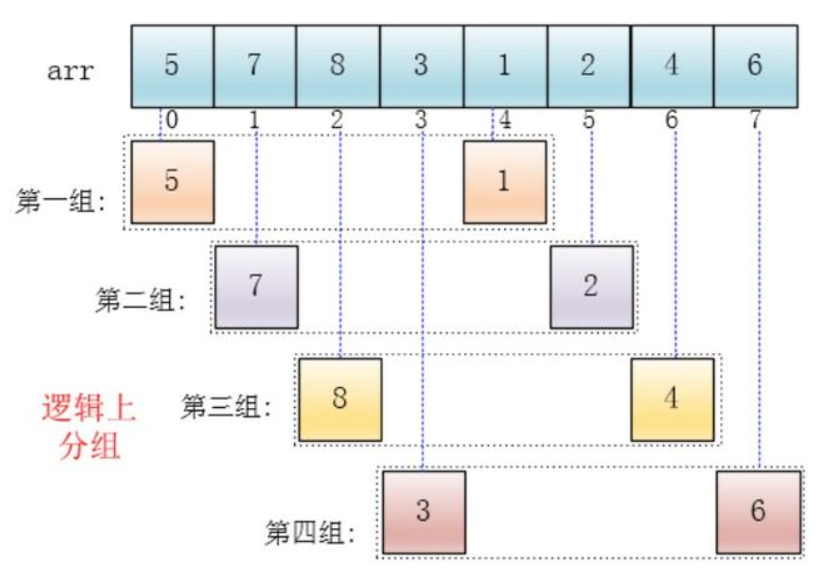
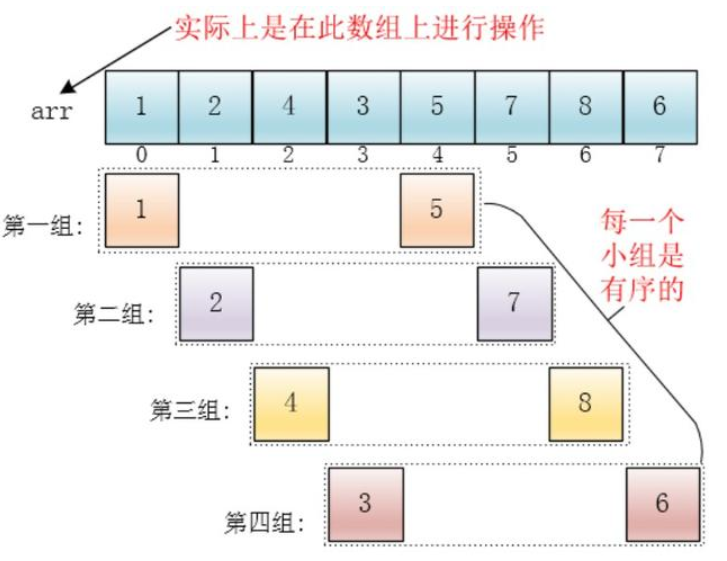

## 排序

#### 选择排序（Selection sort）

一般选择第一个元素为最小元素，和其余元素相比较。若遇到比自身还小的元素，则将此元素设置为最小元素并设置为下表为0的位置。重复此操作直至顺序。

**代码实现**

```java
public class Selection{
	public static void main(String[] args) {
        int temp;
        int a[] = {2,1,5,3,6,4,9,8,7};
        for (int i=0;i<a.length;i++){
            int min = i;
            for (int j=i+1;j<a.length;j++){
                if (a[min]>a[j]){
                    min = j;
                }
            }
            temp = a[min];
            a[min] = a[i];
            a[i] = temp;
        }
        System.out.println(Arrays.toString(a));
    }
}
```

*分析过程如下*：


*出自：《算法4》*

#### 插入排序（Insertion sort）

适用于小规模或者基本有序的时时候，其效率比选择排序更高效。

**代码实现**

```java
public class Insertion{
    public static void main(String [] args){
        int arr[] = {2,1,5,3,6,4,9,8,7};
        int temp;
        
        // 升序排列 i=1 从第二个开始
        for(int i=1;i<arr.length;i++){
            // 前一个元素大于后一个元素，则需排序
            if(arr[i-1]>arr[i]){
                // 保存当前这个数，为了和前面的数作比较，看是否大于自身
				temp = arr[i];
                for(int j=i;j>=0;j--){
                    if(j>0 && arr[j-1] > temp){
                        arr[j] = arr[j-1];
                    }esle{
                        arr[j] = temp;
                        break;
                    }
                }
            }
        }
    }
}
------------------------------------------------------------------------------------
输出：
    [1, 2, 3, 4, 5, 6, 7, 8, 9]
```

*分析过程如下*：


​		首先，以下标5作为例子。  
​		前一个元素大于自身（6 > 4），则temp 记录4，为了和前面所有元素比较，于是下标为5的元素被前一个元素覆盖。再和下标为3的元素比较（5 > 4），则重复之前操作。和下标2的元素比较（3 < 4），则temp 覆盖 下标 2 之后的元素。


*出自：《算法4》*

#### 希尔排序（Shell sort）

插入排序的改进版，使得在大规模或无序的数据也非常有效。  
将大规模数据，分成若干个组，然后对每个组分别进行插入排序，因规模变小，所以效率更高。

**代码实现**

````java
public class Shell {
    public static void main(String[] args) {
        int[]a = {8,9,1,7,2,3,5,4,6,0};
        //递增序列
        int h = 1;
        while (h<a.length/3){
            h = 3*h + 1;
        }
        while (h>=1){
            for (int i = h;i<a.length;i++){
                for (int j = i;j>=h;j-=h){
                    if(a[j]<a[j-h]){
                        int temp = a[j-h];
                        a[j-h] = a[j];
                        a[j] = temp;
                    }
                }
            }
            h = h/3;
        }
        System.out.println(Arrays.toString(a));
    }
}
````






*图片来源于网络，侵删。*


*出自：《算法4》*  
希尔排序的复杂度和增量序列是相关的

{1,2,4,8,...}这种序列并不是很好的增量序列，使用这个增量序列的时间复杂度（最坏情形）是O(n^2^)

Hibbard提出了另一个增量序列{1,3,7，...,2^k-1}^，这种序列的时间复杂度(最坏情形)为O(n^1.5^)

Sedgewick提出了几种增量序列，其最坏情形运行时间为O（n^1.3^）,其中最好的一个序列是{1,5,19,41,109,...}

**本人设置的递增序列通常为**:

(3^k^-1)/2	从N/3递减至1

```java
//数组长度
int N = array.length;
//递增序列
int h = 1;
// 1 4 13 40 121 364... 
while(h < N/3){
    h = 3*h+1;
}
```


#### 归并排序（Merge sort）


#### 快速排序（Quick sort）


#### 堆排序（Heap sort）